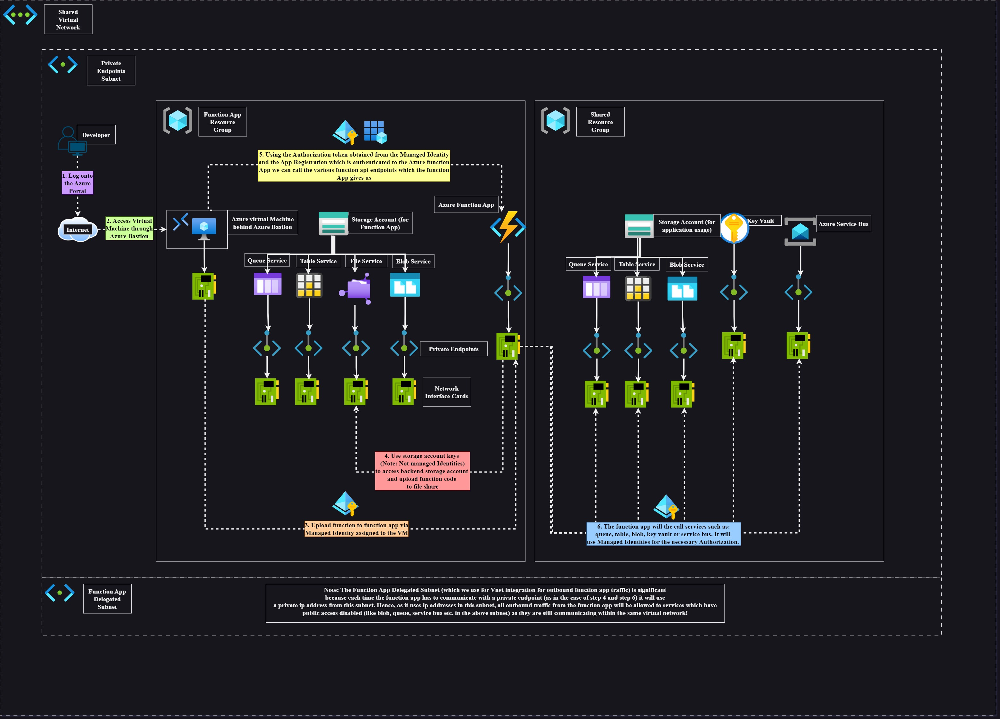

# Summary of repository

This repository demonstrates the usage of Azure function apps with emphasis on private networking (with private endpoints). It demonstrates:

- How to create the infrastructure for Azure function apps. This includes:
  - Using a virtual network and a subnet for the function app and a subnet for the private endpoints. This is referenced not created.
- How to use private endpoints to reach the backend storage account and reach Azure Key Vault.
- How to use Azure Key vault to reference application settings in the Azure function app.
- How to create a managed identity for authentication to Azure Storage Account and Azure Key vault.
- How to use private endpoints to reach the backend storage account.
- How to use a bastion VM to test the function app is working from within the private network.

## Overview Diagram

We also give a summarised picture to detail how the example works:



# Prerequisities

Ensure that you have the following tools installed

- [Terraform](https://developer.hashicorp.com/terraform/install#linux)
  ```
    wget -O- https://apt.releases.hashicorp.com/gpg | sudo gpg --dearmor -o /usr/share/keyrings/hashicorp-archive-keyring.gpg
    echo "deb [signed-by=/usr/share/keyrings/hashicorp-archive-keyring.gpg] https://apt.releases.hashicorp.com $(lsb_release -cs) main" | sudo tee /etc/apt/sources.list.d/hashicorp.list
    sudo apt update && sudo apt install terraform
  ```
- [Dotnet version 8](https://learn.microsoft.com/en-us/dotnet/core/install/linux-ubuntu-install?pivots=os-linux-ubuntu-2204&tabs=dotnet8#ubuntu-2204)
  ```
  sudo apt-get update && sudo apt-get install -y dotnet-sdk-8.0
  ```
- [Core func tools](https://github.com/Azure/azure-functions-core-tools?tab=readme-ov-file#linux)
  ```
  wget -q https://packages.microsoft.com/config/ubuntu/22.04/packages-microsoft-prod.deb
  sudo dpkg -i packages-microsoft-prod.deb
  sudo apt-get update
  sudo apt-get install -y azure-functions-core-tools-4
  ```

# Structure of repository

TODO

# Testing the example

The following steps to configure the example are detailed below. You require a file which matches the name of the input variable!

## Creating the infrastructure

The assumption here is that you already have a resource group and a virtual network with subnets which you can reference.

TODO

> **Note: (⚠️)** After provisioning the infrastructure, ensure that you create a file share (which matches the name of the file share input variables) to house the function app code in the main backend storage account.

## Uploading to the function app

We outline different example functions to upload to the function app.
To create the functions in the function app you will be jumping into the **Azure Bastion VM** and using that as a jumpbox because of the private networking which underpins the whole architecture of this repository. The rest of the examples in this section **assume** you are jumped into the **Azure Bastion VM**. You should probably be skilled with `vim` or `neovim` as a text editor to be able to write code. `neovim`, `tmux`, `dotnet` and `core func tools` is already installed in the jumpbox so there will be no issues with tooling.

Begin by jumping into the vm and running this command: `mkdir my-function-app && cd my-function-app`. We will be building all our functions in this folder.

### Simple HTTP triggered function (FirstFunction)

1. `func init` > `1. dotnet (isolated worker model)` > `1. c# - isolated`
1. `func new` > `2. HttpTrigger` > `Function name: FirstFunction`

> **Note: (⚠️)** Change the authorization level from `Function` to `Anonymous`. **This is important** or you will need the access key to hit the function app. Using the function key to hit the function app negates the whole purpose of using the Microsoft Entra Authentication to hit the function app. And no I am not getting Authentication and Authorization mixed up. I am aware that we are using authentication to prevent people from using the function app. It's much of a much-ness.

To test your functions locally run: `func start`

To upload all functions in this directory run:

- `az login --identity --username <managed identity client id>`
  - Ensure that the user assigned managed identity has at least one role to any resource (could even be itself) in the subscription or else this command will fail. Alternatively you can also use the same command with the extra flag `--allow-no-subscriptions`. The error will occur because in the edge case that the managed identity has no RBAC assignements, it will fail to even find a subscription.
- `func azure functionapp publish <function app name> --force`

## Configuring Function App Authentication (manually)

Steps to configure the function app authentication manually are as follows:

1. Create the service principal in Azure: **Microsoft Entra** > **App registrations** > **New Registration** > Enter a name (e.g **testing-spn**) > **Register** (We will configure the Redirect URI later)
1. Go to the service principal you just created (e.g **testing-spn**) > **Manage** > **Authentication** > **Add a platform** > **Web** > `https://<function app name>.azurewebsites.net/.auth/login/aad/callback` (e.g `https://fa-masonapp.azurewebsites.net/.auth/login/aad/callback`) > tick `ID tokens (used for implicit and hybrid flows)`.
1. **Manage** > **Expose an API** > **Application ID URI (add)** > save the Application ID URI > **Add a scope** > Enter in **Scope name** the exact value `user_impersonation` > Click on **Who can Consent?** to `Admins and users` > Enter in a an admin consent display name and description > **Add scope**
1. Go the function app > **Settings** > **Authentication** > **Add an identity provider** > Select `Microsoft` as your identity provider > pick `Workforce configuration (current tenant)` > In **App registration** pick `Pick an existing app registration in this directory` > Select the **Name or app ID** of your service principal and set the **Client secret expiration** to any one of the drop down values (e.g `90 days (3 months)`). This will create a new secret in XXXXXXXXXXXXXX > For **Issuer URL** go back to your service principal and click on the **endpoints** near the top. select the **WS-Federation sign-on endpoint** and copy that value (e.g `https://login.microsoftonline.com/XXXXXXXX-XXXX-XXXX-XXXX-XXXXXXXXXXXX/wsfed`) and remove the `/wsfed` (e.g `https://login.microsoftonline.com/XXXXXXXX-XXXX-XXXX-XXXX-XXXXXXXXXXXX`). Put this value `https://login.microsoftonline.com/XXXXXXXX-XXXX-XXXX-XXXX-XXXXXXXXXXXX` into the value of **Issuer URL**. > For **Client application requirement** pick `Allow requests from specific client applications` and input the _client_id_ of your managed identity from your VM. > For **Identity Requirement** pick `Allow requests from any identity` > For **Tenant requirement** pick `Allow requests from specific tenants` and type in your tenant id. > For **Restrict Access** pick `Require Authentication` > For **Unauthenticated requests** pick `HTTP 401 Unauthorized: recommended for APIs` > For `Token store` set it to true / pick it. Save everything.
1. Afterwards, click to edit the identity provider you just created. In **Allowed token audiences** type in `api://{application id of your spn}`. This Id should be able to be copied a few lines above in **Application (client) ID**.
   - Generally speaking, as long as you configure the **Allowed token audiences** as a resource URI (as in the command `az account get-access-token --resource <resource URI>` or in the command `curl -X get -H 'MetaData: true' http://169.254.169.254/metadata/identity/oauth2/token?api-version=2018-02-01&resource=<resource URI>`) then the authentication **will** go through.
   - Configuring `https://management.azure.com/`, `https://graph.microsoft.com/`, `https://storage.azure.com/`, `https://vault.azure.net`, `https://database.windows.net/`, `https://servicebus.azure.net/`, `https://batch.core.windows.net/`, `https://dev.azuresynapse.net/`, `https://graph.windows.net/`, `https://api.loganalytics.io/` and any other resource URI endpoints will **all** work as long as you remember to (1) configure the audience in the Azure function app and (2) You include it as the audience URI when generating a resource!
1. Sometimes the Application setting `MICROSOFT_PROVIDER_AUTHENTICATION_SECRET` is not set automatically from this. So to rectify this:
   - Create a new secret for you spn.
   - Save that value into the application setting `MICROSOFT_PROVIDER_AUTHENTICATION_SECRET` if the secret doesn't update.

## Testing

To test that you are able to hit various function app endpoints:

1. Copy the `call-function.sh` script to the vm.
1. In the same directory as `call-function.sh` in your vm, create a file called `environment_variables.sh`. In that file, assign the following values using **Bash syntax**:
   - `MANAGED_IDENTITY_CLIENT_ID=...`
   - `APPLICATION_SERVICE_PRINCIPAL_CLIENT_ID=...`
   - `FUNCTION_APP_NAME=...`
   - `FUNCTION_NAME=...`
1. Run the `call-function.sh` script after you have assigned all those variables the correct values. You should be able to see the response come through.
1. To run other functions you can change the function name. Obviously for more in complex api calls (e.g calls which have a request body or calls which require query paramters) extract the testing code and modify it to your need. The intent is to serve as a starting point / basis to get the authentication through.

# Notes

Some interesting notes that I noted when testing different settings were:

- In the context of **storage account networking** the following patterns of networking access (alongside the following priority in which networking pattern gets listened to) is outlined below:

  1. Setting `public_network_access_enabled=false` will override everything else. This is equivalent to setting `Public Network Access` to **Disabled** in the Azure portal.
  1. Setting `public_network_access_enabled=true` **and** `network_rules { default_action = "Allow" }` will be the next highest priority setting. This is equivalent to setting `Public Network Access` to **Enabled from all networks**.
  1. Setting `public_network_access_enabled=true` **and** `network_rules { default_action = "Deny" <Other options including ip addresses, bypass services etc.> }` will be the next highest priority setting. This is equivalent to setting `Public Network Access` to **Enabled from Selected virtual networks and IP addresses**.

  - Note that if you wanted to set `virtual_network_subnet_ids` to be allowed to connect to the storage account, they require service endpoints to be enabled. I would probably moreso reccomend including the **private ip addresses** instead and using private endpoints.
  - Note that `private_link_access` allows certain resources either in the **current tenant**, **current subscription** or **current resource group** to be able access the storage account.
    - For example setting the `resource_id` to **/subscriptions/{subscription_id}/resourcegroups/{resource_group}/providers/Microsoft.Synapse/workspaces/\*** will allow all synapse workspaces in the resource group to access the storage account.

- With the shared storage account, you can see that through the bastion jumpbox vm (as networking is enabled properly).
- doing `nslookup {storage_account_name}.privatelink.{blob|file|table|queue}.core.windows.net` will resolve the IP addresses for you properly from the bastion jumpbox vm.

- Settings (Site config / App settings)

  - `vnet_route_all_enabled` **supersedes** `WEBSITE_VNET_ROUTE_ALL` : When vnet integrated, route all outbound traffic through vnet.
  - `vnetContentShareEnabled` (doesn't exist in terraform) **supersedes** `WEBSITE_CONTENTOVERVNET` : Enable this setting when your storage account is restricted to a vnet (as in the case of private endpoints). This needs to be enabled to restrict storage account to vnet. The vnetContentShareEnabled in site_config doesn't exist yet.
  - `WEBSITE_CONTENTSHARE` : The name of the function share which the functions use to store function app code
  - `WEBSITE_CONTENTAZUREFILECONNECTIONSTRING` : Connection string for storage account where the function app code is stored. Example: `DefaultEndpointsProtocol=https;AccountName=${azurerm_storage_account.function_app_storage_account.name};AccountKey=${azurerm_storage_account.function_app_storage_account.primary_access_key}`

- In the context of consumption and premium plans, when using Azure file shares as the backend storage it must use a connection string. SMB protocol cannot use managed identities to authenticate.
- The function app can still have a managed identity to do other things like link to other azure services, but managed identities isn't supported at the azure level
- so you must enable the access key from the storage account to allow this because of the three options up above.
- Notice how we didn't enable the `Storage File Data Privileged Contributor` rbac role because we auth with the access key instead.
- Note: this is a good resource for authentication with azure function apps and azure active directory: https://learn.microsoft.com/en-us/azure/app-service/configure-authentication-provider-aad?tabs=workforce-configuration#advanced
- Interesting edge case: Providing valid service principal api id and url, but then DELETING the service principal, though the application still cannot find the service principal it allows authorization to **hit the app**. I don't know for how long though...
