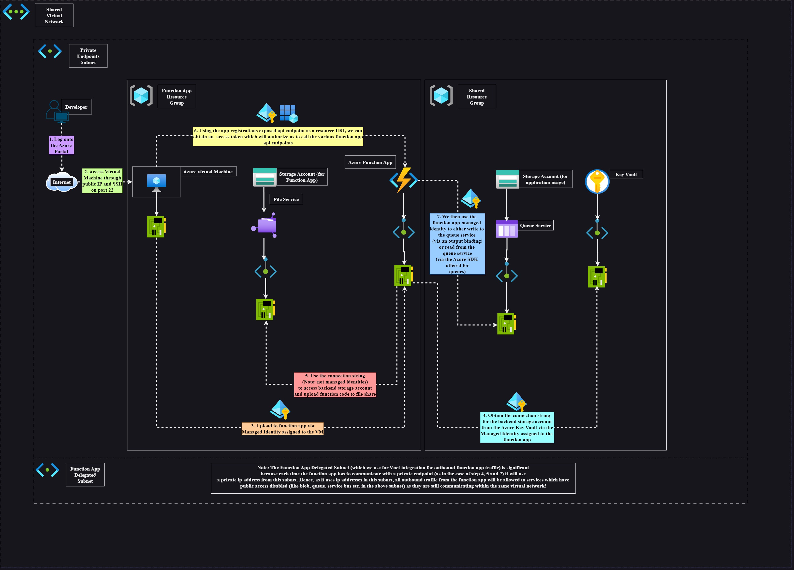

# Repository purpose: authenticating to azure functions with managed identities

The purpose of this repository is to demonstrate the necessary requirements to call a function app's API in a private network using Microsoft Entra Authentication. Key concepts which are explained or demonstrated are:

- The concept of a **jumpbox** to enable private network access to the virtual network. This can be done by Azure Bastion, but for demonstration purposes we just assign a public IP and allow `ssh` on port 22 to a Linux VM.
- The usage of **private endpoints** to enable network communication for Azure resources (e.g **Azure Storage** and **Azure Key Vault**) which are publicly routable by default.
- How to **create and deploy** functions to a function app.
- How to use **managed identities** from the perspective of **function bindings** and from the perspective the a **software development kit (SDK)** in application code.
- How to use **Azure Key Vault** to securely store function app application settings.
- How to set up and use **authentication** to secure function app API's.

The following diagram details the **architecture** of this example:



# Structure of repository

Detailed below is the structure of this repository:

```
.
├── README.md
├── main.tf
├── providers.tf
├── variables.tf
├── function-app-code
│   ├── QueueOutputFunction.cs
│   └── ReadQueueFunction.cs
└── call-function.sh
```

The following is an explanation of each of the files in this repository:

- **[README.md](./README.md)**: This is the file you are currently reading. It serves as the documentation for this repository and explains the purpose of the repository, what files exist and how to use the repository.
- **Terraform configuration files**: These are the files ending in `.tf`. Together they serve as the files which contain all the infrastructure code. You run the files from the directory they are in. So in our case, you would make sure you are in the same working directory as all the `.tf` files.
  - **[variables.tf](./variables.tf)**: Logically the **variables.tf** terraform configuration file tells us what the input variables to the example are. The descriptions of each variable detail whether they are required or optional. They are analgous to the arguments you would pass into a function (if we analogise the running of the terraform configuration files in the current directory like running a function). To pass values to the **variables.tf** file, we would usually create a file exactly called `terraform.tfvars`. `terraform.tfvars` uses HCL and provides the values to the input variables.
  - **[main.tf](./main.tf)**: Logically the **main.tf** is where you put your main resource declarations. All your resource and module declarations would usually go here. Really you can put anything in here. You can even put data blocks or locals blocks. However, my own convention is that once data blocks and local blocks reach a "large enough size" then it makes rational sense to put the data blocks into a **data.tf** and the locals block into a **locals.tf**. In our case we have not needed to do that!
  - **[providers.tf](./providers.tf)**: Logically **providers.tf** details the **version of terraform** we are using (in our case the constraint for terraform is that our system must have terraform version `>=1.7`), the **providers** we use (we use the `azurerm` provider with the version set `=4.5`) and any **additional configuration** for those providers (in our case we set `storage_use_azuread = true`).
- **[function-app-code](./function-app-code/)**: This is a directory with two `.cs` files which represent two functions to be uploaded to our Azure function app.
  - **[QueueOutputFunction.cs](./function-app-code/QueueOutputFunction.cs)**: The first function's code is contained in the file called `QueueOutputFunction.cs`. This file shows how to use an **output binding** to write to a queue service using an **identity based connection** (with a managed identity).
  - **[ReadQueueFunction](./function-app-code/ReadQueueFunction.cs)**: The second function's code is contained in the file called `ReadQueueFunction.cs`. This file shows how to use the **Azure SDK (for queues)** to read from a queue service using a **managed identity**.
- **[call-function.sh](./call-function.sh)**: This is a shell script (written in Bash) which wraps the process of obtaining an access token and making a request to the function endpoint. Later, we go through manually how to configure the access token and use that to make the request. This script just wraps and automates the way which Azure documentation guides people to do it. The difference between the script and the instructions later on is that the **resource URI** configured in the script assumes an app registration is created and is exposed as the **resource URI** whereas in the instructions provided later, we will be using the hardcoded **resource URI** `https://management.azure.com/`. See the appendix for more details.

# Prerequisities

Ensure that you have the following tools installed

- [Terraform](https://developer.hashicorp.com/terraform/install#linux)
  ```
    wget -O- https://apt.releases.hashicorp.com/gpg | sudo gpg --dearmor -o /usr/share/keyrings/hashicorp-archive-keyring.gpg
    echo "deb [signed-by=/usr/share/keyrings/hashicorp-archive-keyring.gpg] https://apt.releases.hashicorp.com $(lsb_release -cs) main" | sudo tee /etc/apt/sources.list.d/hashicorp.list
    sudo apt update && sudo apt install terraform
  ```
- [Azure CLI](https://learn.microsoft.com/en-us/cli/azure/install-azure-cli-linux?pivots=apt)
  ```
  curl -sL https://aka.ms/InstallAzureCLIDeb | sudo bash
  ```
- [Dotnet version 8](https://learn.microsoft.com/en-us/dotnet/core/install/linux-ubuntu-install?pivots=os-linux-ubuntu-2204&tabs=dotnet8#ubuntu-2204)
  ```
  sudo apt-get update && sudo apt-get install -y dotnet-sdk-8.0
  ```
- [Core func tools](https://github.com/Azure/azure-functions-core-tools?tab=readme-ov-file#linux)
  ```
  wget -q https://packages.microsoft.com/config/ubuntu/22.04/packages-microsoft-prod.deb
  sudo dpkg -i packages-microsoft-prod.deb
  sudo apt-get update
  sudo apt-get install -y azure-functions-core-tools-4
  ```

# Provisioning the example

The following steps to configure the example are detailed below.

## Creating the infrastructure

### Prerequisites

The following prerequisites are necessary to create the infrastructure:

- A resource group for where your function app resources will be created. For example `fa-resoure-group`.
- A resource group for where your shared resources will be created. For example `shared-resource-group`.
- A virtual network. For example `shared-vnet` with an address range of `10.0.0.0/16`.
  - A subnet for private endpoints. For example `private-endpoint-subnet` with an address range of `10.0.0.0/24`.
  - A delegate subnet for function apps to do vnet integration with. For example `function-app-outbound` with an address range of `10.0.1.0/24`.
- RBAC role: `Key Vault Secrets Officer` at minimum to be able to create and store permissions into the key vault.
- A network security group attached to your subnet for private endpoints (for example `private-endpoint-subnet`) which has an inbound security rule for **SSH on port 22** which allows access.

We assume that you will be authenticated to be able to run the commands for Terraform. If not already done, run `az login` and set the subscription to the one which contains the two resource groups and virtual network.

### Provide values to terraform input variables

Next create a file called `terraform.tfvars` and fill in the required input variables to the `.tf` files. The following code sample is provided as a basis / start, but ensure that you fill it in properly with the correct values from your environment.

```
############################################################################
# terraform.tfvars sample code
############################################################################

function_app_resource_group_name  = "dev-rg"
shared_resource_group_name        = "shared-rg"
function_app_storage_account_name = "XXXXXXXXXXXXXXXXXXXXXXXX"
function_app_subnet_id            = "/subscriptions/XXXXXXXX-XXXX-XXXX-XXXX-XXXXXXXXXXXX/resourceGroups/shared-rg/providers/Microsoft.Network/virtualNetworks/shared-vnet/subnets/function-apps-subnet"
private_endpoint_subnet_id        = "/subscriptions/XXXXXXXX-XXXX-XXXX-XXXX-XXXXXXXXXXXX/resourceGroups/shared-rg/providers/Microsoft.Network/virtualNetworks/shared-vnet/subnets/private-endpoint-subnet"
shared_storage_account_name       = "XXXXXXXXXXXXXXXXXXXXXXXX"
file_share_name                   = "function-content"
public_access_enabled             = true
connection_name_secret            = "function-app-connection"
destroy_connection_name_secret    = false

tags = {
  created_by = "terraform"
  purpose    = "testing_function_app_authentication"
}
```

### Command line instructions

After providing values to the terraform input variables, you should run the following commands:

1. `terraform init`: This will pull in the binary for the azure provider and clone and modules which are being used to the `.terraform` directory.
1. `terraform plan`: To perform a dry run and see what infrastructure will **potentially** be provisioned.
1. `terraform apply -auto-approve`: This will actually provision the infrastructure to your remote Azure environment.

After you have finished with all the infrastructure, to destroy the infrastructure it requires two steps:

1. Set the input variable `destroy_connection_name_secret = true` then run `terraform apply -auto-approve`. This will delete the secret for the backend storage accounnt connection string which is contained in your key vault. We must do this because we cannot delete key vault if it has any data in it.
1. Run `terraform apply -auto-approve -destroy` to destroy the infrastructure in your remote Azure environment.

## Uploading to the function app

We outline different example functions to upload to the function app.
To create the functions in the function app you will be jumping into the **Azure VM** and using `ssh` and using the VM as a jumpbox because of the private networking which underpins the whole architecture of this repository. The rest of the examples in this section **assumes** you are jumped into the **Azure VM**. You should probably be skilled with `vim` or `neovim` as a text editor to be able to write code. `neovim`, `tmux`, `dotnet` and `core func tools` is already installed in the jumpbox so there will be no issues with tooling.

> **Note: (⚠️)** Change the authorization level from `Function` to `Anonymous`. **This is important** or you will need the access key to hit the function app. Using the function key to hit the function app negates the whole purpose of using the Microsoft Entra Authentication to hit the function app. And no I am not getting Authentication and Authorization mixed up. I am aware that we are using authentication to prevent people from using the function app. It's much of a much-ness.

Begin by jumping into the vm and running this command: `mkdir function-app && cd function-app`. We will be building all our functions in this folder.

### Simple HTTP triggered function (FirstFunction)

**Purpose**: The purpose of this function is to demonstrate how to upload a function to our function app. It simply exists to show **how** to deploy.

1. `func init` > `1. dotnet (isolated worker model)` > `1. c# - isolated`
1. `func new` > `2. HttpTrigger` > `Function name: FirstFunction`
1. Edit the function to change the authorization level from `Function` to `Anonymous`.
1. **Optionally**: To test this function locally run `func start`

   - Open `tmux` and press `<C-a>I` to install the nice theme (Note: `<C-a>` stands for pressing `ctrl` **with** `a` as one _chord_. The `I` after it means to press `I` after the `<C-a>`).
   - Press `<C-a>n` to open up a vertical split. Navigate these splits with `<C-h>` to go left and `<C-l>` to go right (these are vim-like motions).
   - In the left hand split window, run the command `func start`.
   - then run the command `curl -X GET http://localhost:7071/api/FirstFunction` to hit `FirstFunction`.

1. Authenticate via AZ CLI with the command `az login --identity --username <managed identity client id>`.

   - Ensure that the user assigned managed identity has at least one role to any resource (could even be itself) in the subscription or else this command will fail. Alternatively you can also use the same command with the extra flag `--allow-no-subscriptions`. The error will occur because in the edge case that the managed identity has no RBAC assignements, it will fail to even find a subscription.

1. Deploy the functions in this repository with the command `func azure functionapp publish <function app name>`

### Queue output binding function with Managed Identity connection (QueueOutputFunction)

**Purpose**: The purpose of this function is to demonstrate the concept of **bindings** and **identity based connections** in Azure function apps.

- **Bindings**: In this example we demonstrate how to use a _queue output binding_ to write to the shared storage account. It is analagous to the archetypal `hello world` program. We trigger this function with a simple HTTP request, and the payload will be written to the `Message Text` portion of the Queue we are writing to.

- **Identity Based Connections**: A secondary point we want to demonstrate is using an Identity Based Connection via managed identities. To do this, we must ensure that the variables `SharedStorageAccount__accountName`, `SharedStorageAccount__clientId` and `SharedStorageAccount__credential` are set correctly. We must also ensure that we reference the identity prefix, in this case it is `SharedStorageAccount`, as the input to the `Connection` paramter for the output binding.

To begin this example:

1. Install the dotnet package for storage queues: `dotnet add package Microsoft.Azure.Functions.Worker.Extensions.Storage.Queues --version 5.0.0`.
1. Copy the code from `./function-app-code/QueueOutputFunction.cs` to a file with the same name.
1. Run `dotnet build`
1. Authenticate via AZ CLI with the command `az login --identity --username <managed identity client id>`.

   - Ensure that the user assigned managed identity has at least one role to any resource (could even be itself) in the subscription or else this command will fail. Alternatively you can also use the same command with the extra flag `--allow-no-subscriptions`. The error will occur because in the edge case that the managed identity has no RBAC assignements, it will fail to even find a subscription.

1. Deploy the functions in this repository with the command `func azure functionapp publish <function app name>`

### Using Azure SDK with queues and managed identities (ReadQueueFunction)

**Purpose**: The purpose of this function is to demonstrate using the Azure SDK for queues with **managed identities**.

- **Managed Identities**: We use managed identities in a different way. We instead, explicitly reference the **queue URI** endpoint and the **managed identity client ID** through the `Environment.GetEnvironmentVariable(<env variable>)` function. We still use the same variables which were present in the app setting variables for the `SharedStorageAccount` except we reference the environment variables explicitly.

To begin this example:

1. Install the following dotnet packages
   - For storage queues: `dotnet add package Azure.Storage.Queues`
   - For using **DefaultAzureCredential** for managed identities: `dotnet add package Azure.Identity`.
1. Copy the code from `./function-app-code/ReadQueueFunction.cs` to a file with the same name.
1. Run `dotnet build`
1. Authenticate via AZ CLI with the command `az login --identity --username <managed identity client id>`.

   - Ensure that the user assigned managed identity has at least one role to any resource (could even be itself) in the subscription or else this command will fail. Alternatively you can also use the same command with the extra flag `--allow-no-subscriptions`. The error will occur because in the edge case that the managed identity has no RBAC assignements, it will fail to even find a subscription.

1. Deploy the functions in this repository with the command `func azure functionapp publish <function app name>`

## Calling function endpoints

To call function endpoints we first of all assume that you are still in the Azure VM. The two steps to call the endpoints are: **obtain the access token** and **call the corresponding function app api endpoint**.

1. **Obtaining the access token**: To obtain the correct access token enter the commands:
   ```
   az login --identity --username <managed identity client id>
   token=$(az account get-access-token --resource 'https://management.azure.com/' | jq --raw-output '.accessToken')
   ```
1. **Call the corresponding function app api endpoint**: To call the function app api endpoints, examples are provided for the case of each function:
   - **FirstFunction**: The **FirstFunction** is just a test function and exists to show authentication is working. To call it use: `curl -X GET -H "Authorization: Bearer $token" 'https://<function app name>.azurewebsites.net/api/firstfunction'`
   - **QueueOutputFunction**: The **QueueOutputFunction** has 3 different ways to correcty send data to the queue. Examples are detailed below:
     - Send simple message to queue: `curl -X GET -H "Authorization: Bearer $token" 'https://<function app name>.azurewebsites.net/api/queueoutputfunction'`
     - Send simple string payload to queue: `curl -X POST -H "Authorization: Bearer $token" -H 'Content-Type: text/plain' -d 'mason' 'https://<function app name>.azurewebsites.net/api/queueoutputfunction'`
     - Send simple JSON payload to queue: `curl -X POST -H "Authorization: Bearer $token" -H 'Content-Type: application/json' -d '{"Key": "mason", "Value": "7"}' 'https://<function app name>.azurewebsites.net/api/queueoutputfunction'`
   - **ReadQueueFunction**: The **ReadQueueFunction** reads from the queue and deletes the oldest message from the queue. To call it use: `curl -X GET -H "Authorization: Bearer $token" 'https://<function app name>.azurewebsites.net/api/readqueuefunction'`

# Appendix

## Manually configuring the app registration and function app authentication

Steps to configure the function app authentication manually are as follows:

1. Create the service principal in Azure: **Microsoft Entra** > **App registrations** > **New Registration** > Enter a name (e.g **testing-spn**) > **Register** (We will configure the Redirect URI later)
1. Go to the service principal you just created (e.g **testing-spn**) > **Manage** > **Authentication** > **Add a platform** > **Web** > `https://<function app name>.azurewebsites.net/.auth/login/aad/callback` (e.g `https://fa-masonapp.azurewebsites.net/.auth/login/aad/callback`) > tick `ID tokens (used for implicit and hybrid flows)`.
1. **Manage** > **Expose an API** > **Application ID URI (add)** > save the Application ID URI > **Add a scope** > Enter in **Scope name** the exact value `user_impersonation` > Click on **Who can Consent?** to `Admins and users` > Enter in a an admin consent display name and description > **Add scope**
1. Go the function app > **Settings** > **Authentication** > **Add an identity provider** > Select `Microsoft` as your identity provider > pick `Workforce configuration (current tenant)` > In **App registration** pick `Pick an existing app registration in this directory` > Select the **Name or app ID** of your service principal and set the **Client secret expiration** to any one of the drop down values (e.g `90 days (3 months)`). This will create a new secret in XXXXXXXXXXXXXX > For **Issuer URL** go back to your service principal and click on the **endpoints** near the top. select the **WS-Federation sign-on endpoint** and copy that value (e.g `https://login.microsoftonline.com/XXXXXXXX-XXXX-XXXX-XXXX-XXXXXXXXXXXX/wsfed`) and remove the `/wsfed` (e.g `https://login.microsoftonline.com/XXXXXXXX-XXXX-XXXX-XXXX-XXXXXXXXXXXX`). Put this value `https://login.microsoftonline.com/XXXXXXXX-XXXX-XXXX-XXXX-XXXXXXXXXXXX` into the value of **Issuer URL**. > For **Client application requirement** pick `Allow requests from specific client applications` and input the _client_id_ of your managed identity from your VM. > For **Identity Requirement** pick `Allow requests from any identity` > For **Tenant requirement** pick `Allow requests from specific tenants` and type in your tenant id. > For **Restrict Access** pick `Require Authentication` > For **Unauthenticated requests** pick `HTTP 401 Unauthorized: recommended for APIs` > For `Token store` set it to true / pick it. Save everything.
1. Afterwards, click to edit the identity provider you just created. In **Allowed token audiences** type in `api://{application id of your spn}`. This Id should be able to be copied a few lines above in **Application (client) ID**.
   - Generally speaking, as long as you configure the **Allowed token audiences** as a resource URI (as in the command `az account get-access-token --resource <resource URI>` or in the command `curl -X get -H 'MetaData: true' http://169.254.169.254/metadata/identity/oauth2/token?api-version=2018-02-01&resource=<resource URI>`) then the authentication **will** go through.
   - Configuring `https://management.azure.com/`, `https://graph.microsoft.com/`, `https://storage.azure.com/`, `https://vault.azure.net`, `https://database.windows.net/`, `https://servicebus.azure.net/`, `https://batch.core.windows.net/`, `https://dev.azuresynapse.net/`, `https://graph.windows.net/`, `https://api.loganalytics.io/` and any other resource URI endpoints will **all** work as long as you remember to (1) configure the audience in the Azure function app and (2) You include it as the audience URI when generating a resource!
1. Sometimes the Application setting `MICROSOFT_PROVIDER_AUTHENTICATION_SECRET` is not set automatically from this. So to rectify this:
   - Create a new secret for you spn.
   - Save that value into the application setting `MICROSOFT_PROVIDER_AUTHENTICATION_SECRET` if the secret doesn't update.

## Use the app registration as the resource URI

To test that you are able to hit various function app endpoints:

1. Copy the `call-function.sh` script to the vm.
1. In the same directory as `call-function.sh` in your vm, create a file called `environment_variables.sh`. In that file, assign the following values using **Bash syntax**:
   - `MANAGED_IDENTITY_CLIENT_ID=...`
   - `APPLICATION_SERVICE_PRINCIPAL_CLIENT_ID=...`
   - `FUNCTION_APP_NAME=...`
   - `FUNCTION_NAME=...`
1. Run the `call-function.sh` script after you have assigned all those variables the correct values. You should be able to see the response come through.
1. To run other functions you can change the function name. Obviously for more in complex api calls (e.g calls which have a request body or calls which require query paramters) extract the testing code and modify it to your need. The intent is to serve as a starting point / basis to get the authentication through.

# References

- Terraform configuration files get concatenated: https://developer.hashicorp.com/terraform/language/files#directories-and-modules
- Terraform configuration files naming standard: https://developer.hashicorp.com/terraform/language/style#file-names
- Terraform input variables are analgous to function arguments: https://developer.hashicorp.com/terraform/language/values/variables
- Terraform can use input `.tfvars` files to pass in values to input variables: https://developer.hashicorp.com/terraform/language/values/variables#variable-definitions-tfvars-files
